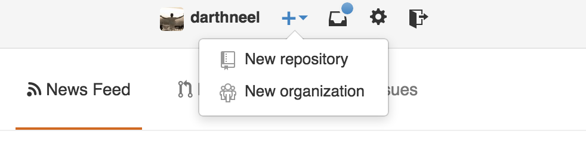
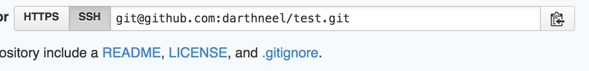

##How to deploy a JS/Node TCP application to Digital Ocean

---

###Getting our code set up with Github

- Ensure that the code you want to deploy is *OUTSIDE* of any other Git repository. This includes our `artemis` or `diana` folders.

- Navigate to the root directory of the code you want to deploy
  - e.g.
  ```bash
  cd ~/code/my_app
  ```
- Let's turn this directory from a regular directory to a Git directory
 - e.g.
 ```bash
git init
```
- Lets create a repository on Github in which we will store our code. Go to [Github](www.github.com) and click the `+` sign in the top right corner to create a new repo.
  - e.g.
  
- I would suggest giving this repo the same name as the corresponding folder on your computer.
- Copy the SSH link provided to you after the repo has been created. You will need to paste it into your terminal in the next step!
  - e.g.
  
- Back in your terminal, use the `git remote add origin` command to link the directory on your computer with the repo on Github
  - e.g.
  ```bash
git remote add origin SSH_LINK_TO_YOUR_REPO
```
- Now just add, commit, and push your code to Github!
  - e.g.
  ```bash
    git add -A :/
    git commit -m "initial commit"
    git push origin master
    ```
- You can refresh the repo's page on Github and if all went well, you should see your code!

---

###Creating your Digital Ocean droplet

- Log into your Digital Ocean account
- Click the green `Create a Droplet` button in the top right corner.
- At this point you get to set up the specifics of your droplet.
  - Give it a name
  - Pick your Droplet size (probably go for the cheapest?)
  - Select a region (USA makes sense)
  - Select image (Pick Ubuntu)
- Lastly, there is an `Add SSH Key` option. *YOU SHOULD ONLY DO THIS THE FIRST TIME YOU DEPLOY*. After that, just select the SSH key you previously added.
  - Lets use the command line to copy our SSH key to our clipboard
    - e.g.
    ```bash
    pbcopy < ~/.ssh/id_rsa.pub
    ```
  - Click the `Add SSH Key` link and paste your SSH key into the text box.
  - Click the green `Add SSH Key` button to save it.

Huzzah, your Droplet has been created!

---

### Setting up the Droplet and Pulling Our Code

Now that the Droplet has been created, we can use its IP address to log into it.

```bash
ssh root@YOUR_DROPLETS_IP_ADDRESS
```

Lets first run a quick update
- `sudo apt-get update`

Remember from lecture, what do we need to install?

- git
  - `sudo apt-get install git`
- node
  - `sudo apt-get install nodejs`
- node-legacy
  - `sudo apt-get install nodejs-legacy`
- npm
  - `sudo apt-get install npm`

Now that we have Git, we can simply clone our repo from Github onto our Ubuntu box.
**THIS MUST BE THE HTTPS LINK, NOT THE SSH LINK WHICH GITHUB WILL DEFAULT TO**

**ONE MORE TIME. GRAB THE HTTPS LINK**
```bash
git clone YOU_REPO_HTTPS_LINK
```
**IF THIS DOESNT WORK, MAKE SURE YOU GRABBED THE RIGHT LINK!**
And congrats, your code is now on the Ubuntu box!

---

### Keeping it Running

If you close your terminal, your app will stop running.  To keep it running, you can run the following:

`nohup node server.js &`.  This will run the server in the background.  You'll still have to type `<Ctrl-c>` to get out of it, but now the server will keep running, even if you exit the Digital Ocean server or close your terminal window.

---

### Closing it
Run `ps aux | grep node`, copy the number in the 2nd column of the first row, and type `kill -9 <that number>`.

For example, I see this:

```
root     12648  0.1  2.1 669608 10648 ?        Sl   21:24   0:00 node server.js
root     12722  0.0  0.1  11740   936 pts/0    S+   21:26   0:00 grep --color=auto node
```

I can type `kill -9 12648` to kill my server.
