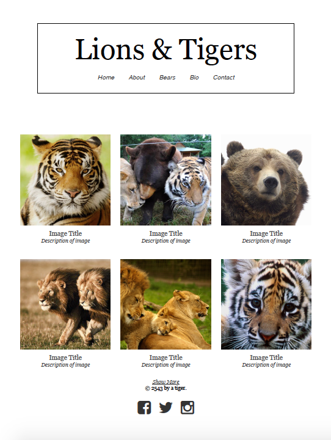

# Pure Design

You're a web developer working closely with a designer to create a simple portfolio for an artist who specializes in wildlife photography.

**The designer has given you this mockup:**

For a closer look, check out the `mockup.pdf` file in this folder. It's up to you to turn the designer's vision into reality!

### Directions:

Using HTML and the Pure CSS library, turn the above mockup into single web page.

#### Resources:

- **[Pure CSS Documentation](http://purecss.io/)**
- **[FontCDN](http://fontcdn.org/)**
- **[Font Awesome](http://fortawesome.github.io/Font-Awesome/)**

### Bonus:

* Create HTML pages for each of the website sections listed in the current nav bar. Have the nav bar link to these files (don't worry about creating a server - for this exercise, we'll just be working on the visual/layout aspect of the pages).
* On your Contact page - include a styled form for contacting the company, and/or for subscribing to a newsletter email.
* On the "About" page, list a few "Current Events" as posts.
  * Each event post should have a Pure CSS button that asks "Find Out More" (this button does not need to lead anywhere).
* On this index page change the nav bar to include drop down subsections.

### Keep In Mind

When designing using a grid, make sure to keep the structure of your grid and the styling of your website's content separate. Avoid changing the margins, padding, and border of your rows, columns, or other grid elements.

Instead of styling your grid elements directly, add style rules to the elements inside of your columns and rows.
