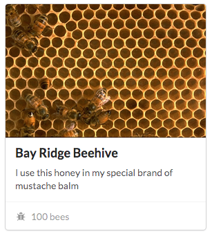

# Urban Apiary

Bees are disappearing from the world at large at an alarming rate! You've ***bee***n tasked with creating a **single page web application (SPA)** to help [NYC Urban Beekeeper Zane "Honeybear" Potts](https://pbs.twimg.com/media/BSScjxrCYAAngQQ.jpg) keep track of the beehives he's keeping all over the borough of Brooklyn.

### Objectives:

You'll be building out the front end of this application. We've provided a [JSON Server](https://github.com/typicode/json-server) backend for you to practice with.

Start your server like so:

`json-server --watch bees.json`

...then visit `localhost:3000` to see what the BUZZ is all about!

#### Use AJAX to make GET, PUT, POST and DELETE requests from your client-side JavaScript.

- A user should ***bee*** able to see a list of all their beehives on the main page, and...
- ...create a new beehive
- ...edit an existing beehive
- ...delete an existing beehive

You're responsible for writing the logic to load and display all the beehives, make calls to your server, AND managing what happens to your DOM elements when a CRUD action takes place.

**Remember to keep the information displayed on the DOM synced up with what's in your database!** You don't want to give your user out-of-date or incorrect information.

## Bonus

Check out [Semantic UI](http://semantic-ui.com/) over the weekend. Try using the [card](http://semantic-ui.com/views/card.html) module to display information about a specific beehive.
