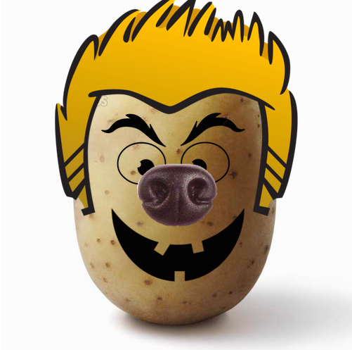
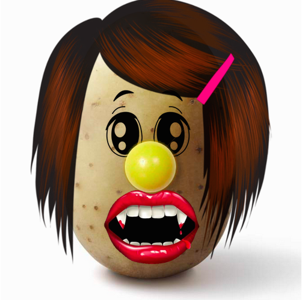
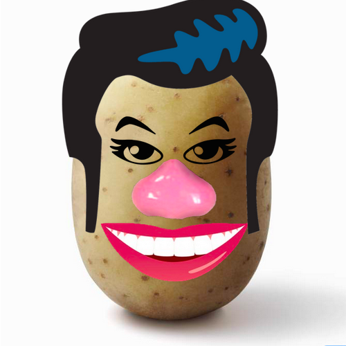

# Mr. Edible Starchy Tuber Head

### Objectives

Tonight, we'll be creating a version of a popular children's toy *Mr. Potato Head* that can be played in the browser using a Backbone model and view! In doing so, you'll practice...

- ...writing the code necessary to create a new "Potato" model constructor function by extending Backbone's default Model class
- ...creating a new View constructor for your potato by extending Backbone's default View class
- ...listening for user input/action and using `.get()` and `.set()` methods to modify your model's attributes

## Directions

A starter `index.html` page and stylesheet have been provided for you. jQuery, Underscore, and Backbone are already linked. Do your work in the `potato.js` file.

1. Your potato should be represented by a model with `hat`, `eyes`, `nose`, and `mouth` attributes.
- When the page is loaded, your potato should render with some default images (check out the template in index.html). Your potato should be rendered into the div with an id of `potato`.
- When a user makes a change to any of the `select` elements below, you should change the attributes of your potato accordingly.
- When any of your potato model's attributes change, your potato view should be re-rendered.

| Example 1 | Example 2 | Example 3 |
| --------- | --------- | --------- |
|  |  |  |

### Resources

- [**Backbone Documentation**]()
- [**Underscore Templating**]()
