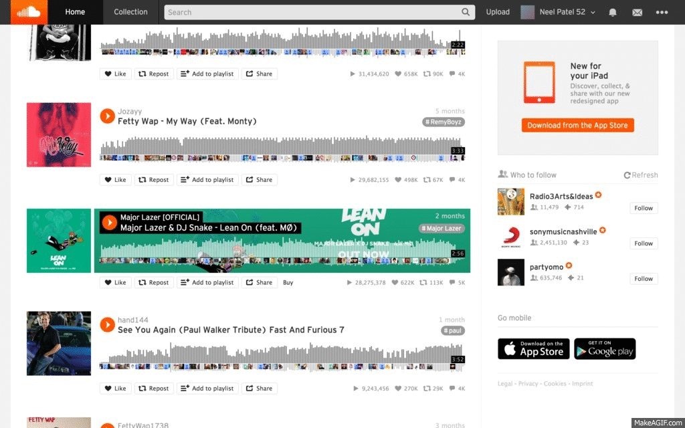

# Driving Music

<!--  -->

---

### Intro

We have provided the backend and some of the front-end for a Mario Kart character site that keeps track of each character's favorite driving song.

Per the `db.json` file each character has the below attributes:

- id
- name
- weightClass
- imageUrl
- drivingMusic

**Goal**: Implement a front-end using Backbone.js

On top of providing the database, we have also given you some base HTML and (bad) CSS. Feel free to change them or add on top!

###Requirements

**MVP**

- See all characters in the database and their attributes
- Be able to play each character's `drivingMusic`
- Add new characters to the database
- Remove a character from the database

*Important Note* - As you add and remove characters from the database, make sure that this is also reflected on the DOM.

*Possibly helpful information* - [Backbone built-in events](http://backbonejs.org/#Events-catalog)

**After MVP**
- Implement an edit feature for each character

**How will you get music?**

You can use Soundcloud's embedded player to get music. Once you have `<iframe>` code, putting it anywhere in your HTML will automatically show a Soundcloud player with that song.

**Data**

Below is a quick chart of some Mario Kart characters, so you don't need to go hunting around the internet.

|name|weight|image|
|----|------|-----|
|Mario|Medium|http://vignette3.wikia.nocookie.net/mariokart/images/4/4c/MK64Mario.PNG/revision/latest?cb=20140507030827|
|Luigi|Medium|http://vignette1.wikia.nocookie.net/mariokart/images/1/16/MK64Luigi.PNG/revision/latest?cb=20140507030827|
|Peach|Light|http://vignette1.wikia.nocookie.net/mariokart/images/e/e3/MK64Peach.PNG/revision/latest?cb=20140507030826|
|Toad|Light|http://vignette3.wikia.nocookie.net/mariokart/images/3/3b/MK64Toad.PNG/revision/latest?cb=20140507030827|
|Yoshi|Light|http://vignette2.wikia.nocookie.net/mariokart/images/0/08/MK64Yoshi.PNG/revision/latest?cb=20140507030826|
|Bowser|Heavy|http://vignette3.wikia.nocookie.net/mariokart/images/e/ee/MK64Bowser.png/revision/latest?cb=20140507030825|
|Donkey Kong|Heavy|http://vignette3.wikia.nocookie.net/mariokart/images/2/23/MK64D.K..png/revision/latest?cb=20140507030825|
|Wario|Heavy|http://vignette1.wikia.nocookie.net/mariokart/images/1/1d/MK64Wario.png/revision/latest?cb=20140507030826|

---

### Process

**DON'T COPY AND PASTE, YOU WILL LEARN NOTHING**

As we have mentioned, Backbone is a highly configurable library. This means that the way we use it will change based on each use case.

Before you start coding, be sure to spend enough time thinking about the structure of the application.

- Which pieces of Backbone will I need and why?

Also, it can be very help to draw out the series of events that will take place within Backbone for each of our requirements.

- i.e. Once I click the `Add Driver!` button, what do I need Backbone to do?

---
### Bonus

- Add an attribute to each model to to hold `vote` data. Each view should then have a button to `vote` for that character.
- Have the characters displayed by votes, ordered from highest to lowest.
